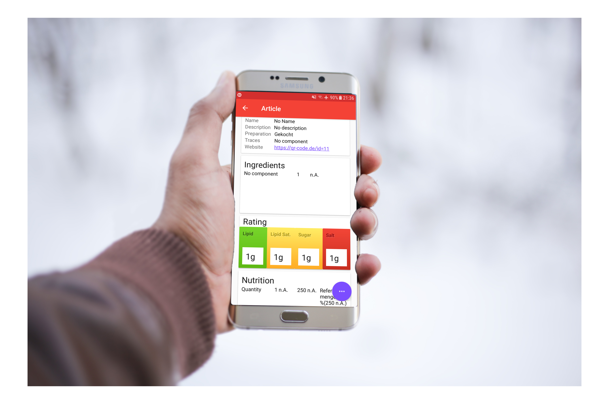
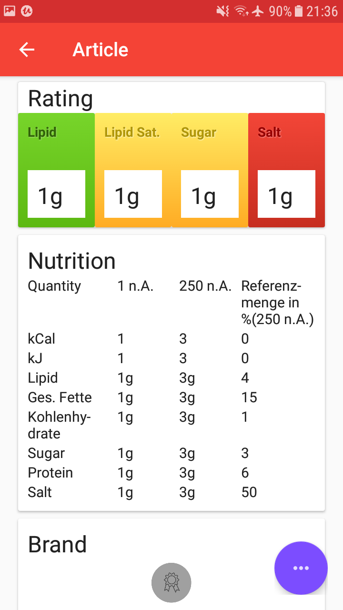
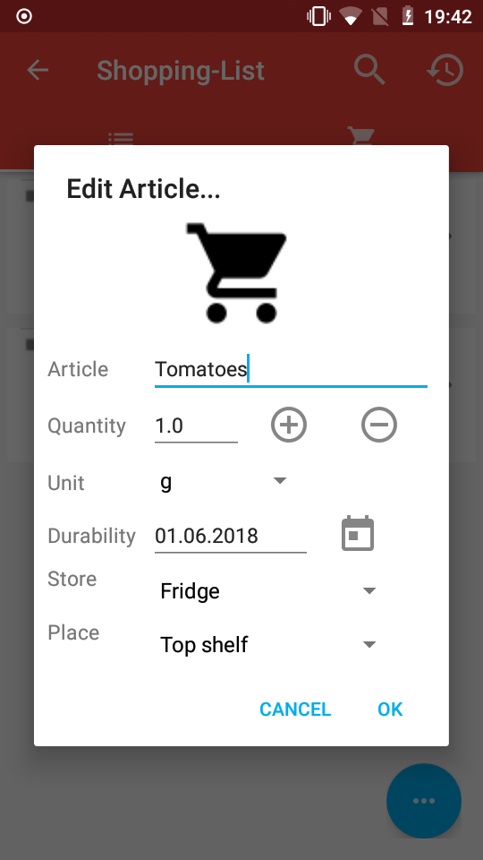
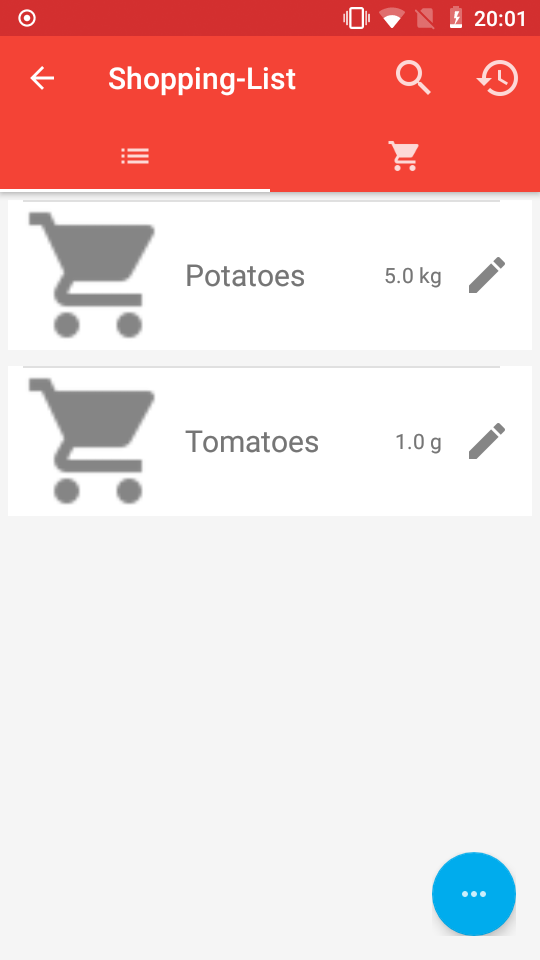
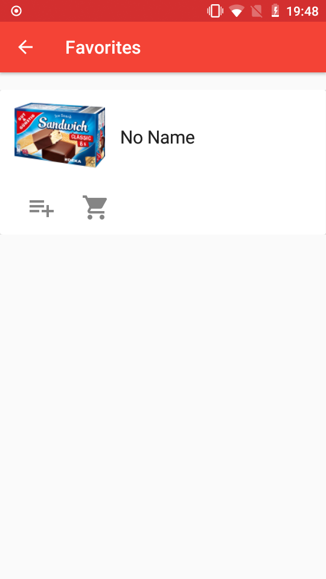

# App
<p align="center">
  
</p>


# Intro
Dieses Projekt ist ein Ausschnitt einer App für Lebensmittelauskünfte.
Lediglich der Ordner - "zxing-android-embedded" ist nicht von mir sondern ist Teil eines Fork eines anderen GitHub Benutzers.

<p align="center">
  
</p>

<p align="center">
  
</p>

<p align="center">
  
</p>

<p align="center">
  
</p>

<p align="center">
  
</p>

# Sprachen
Das Projekt wurde mithilfe folgender Sprachen realisiert:
<br />
 * JAVA
 * XML

## Mein Quellcode zu der App befindet sich unter folgendem Pfad
```
https://github.com/GitHubMyHub/android_app/tree/master/app/src/main/java/com/toolbardemo/mytestapp
```
